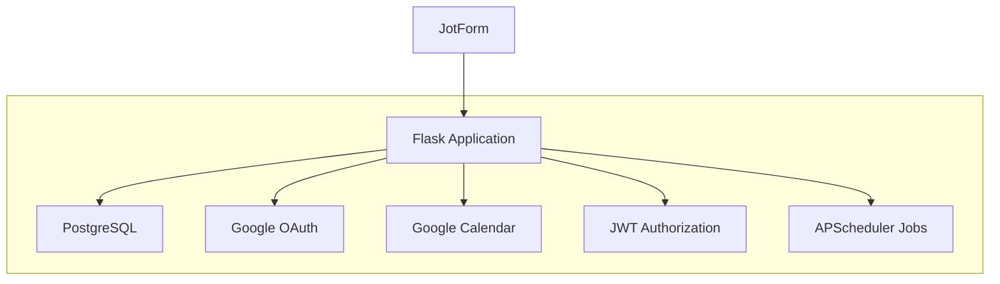
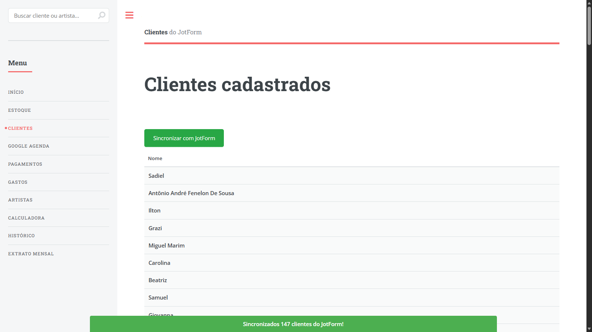
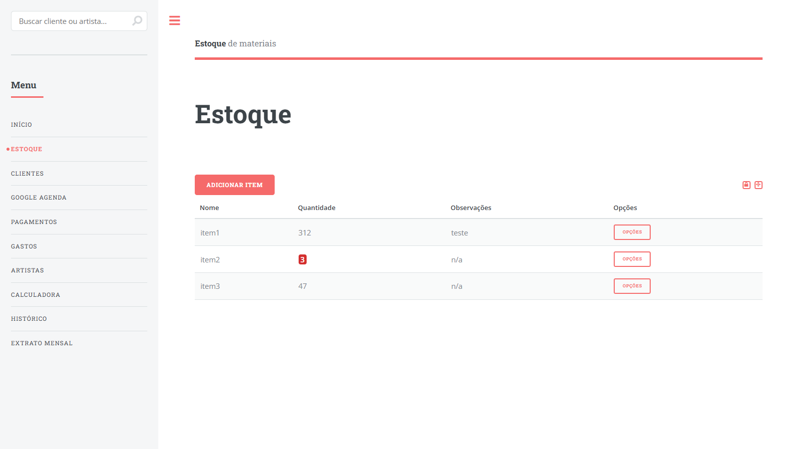
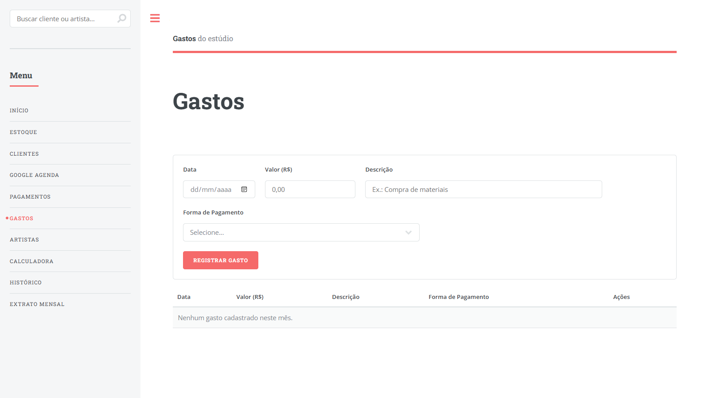
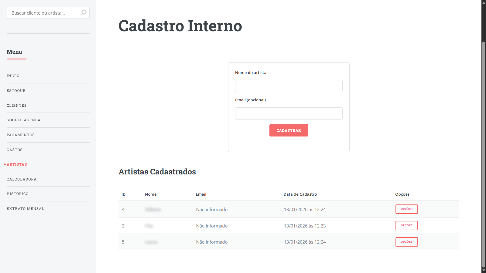

# Tattoo Studio Management System

[](https://github.com/diediegodie/tattoo_studio_system_v4/actions/workflows/ci-cd.yml)
[](https://github.com/diediegodie/tattoo_studio_system_v4/actions/workflows/monthly_extrato_backup.yml)

A full-stack management platform built for tattoo studios, centralizing client management, appointment tracking, inventory control, and financial operations into a single system.

Designed with production-oriented practices including automated testing, CI/CD, secure authentication, cloud deployment, and financial data integrity.

---

# Overview

This application was created to solve real operational challenges faced by tattoo studios.

The platform provides:

* Client management
* Session tracking
* Inventory control
* Financial reporting
* Google Calendar integration
* Automated monthly statements
* OAuth-based authentication
* Automated backups and monitoring

---

# Engineering Highlights

* 370+ automated tests
* Flask + PostgreSQL architecture
* Dockerized development environment
* GitHub Actions CI/CD pipeline
* Google OAuth 2.0 authentication
* JWT-based authorization
* Automated monthly financial processing
* Atomic database transactions
* Batch processing for large datasets
* Cloud deployment using Render and Neon

---

# Technology Stack

## Backend

* Flask
* SQLAlchemy
* PostgreSQL
* APScheduler
* JWT Authentication

## Frontend

* Jinja2 Templates
* HTML5
* CSS3
* Vanilla JavaScript (ES6+)

## Infrastructure

* Docker
* Docker Compose
* GitHub Actions
* Render
* Neon PostgreSQL

## Integrations

* Google OAuth 2.0
* Google Calendar
* JotForm API

---

# Architecture



---

# Core Features

## Client Management

The platform maintains a centralized customer database with automatic synchronization from JotForm submissions.

<p align="center">
  
</p>

### Features

* Automatic client import
* Client profile management
* Session history tracking
* Search and filtering
* Contact information management

---

## Inventory Management

Inventory operations are managed through a dedicated module designed for real-world studio workflows.

<p align="center">
  
</p>

### Features

* Product stock tracking
* Inventory updates
* Low-stock monitoring
* CRUD operations with authorization
* Usage history

---

## Financial Operations

The financial module provides expense tracking, revenue monitoring, and automated statement generation.

<p align="center">
  
</p>

### Features

* Expense tracking
* Revenue calculation
* Monthly statements
* Historical archival
* Automated financial processing

---

## Session Tracking

The system allows tattoo artists and studio managers to register and track appointments and sessions.

<p align="center">
  
</p>

### Features

* Session records
* Client relationships
* Payment tracking
* Calendar integration
* Service history

---

# Security

The application follows several security best practices:

* Google OAuth 2.0 authentication
* Email-based authorization
* JWT token validation
* Rate limiting
* Secure session handling
* SQL injection protection through SQLAlchemy
* HTTPS support in production
* Environment-based secret management

---

# Project Structure

```text
tattoo_studio_system_v4/
├── backend/
│   ├── controllers/
│   ├── services/
│   ├── repositories/
│   ├── models/
│   ├── core/
│   └── tests/
│
├── frontend/
│   ├── templates/
│   └── assets/
│
├── docs/
│
├── .github/workflows/
│
└── docker-compose.yml
```

---

# Getting Started

## Clone Repository

```bash
git clone https://github.com/diediegodie/tattoo_studio_system_v4.git

cd tattoo_studio_system_v4
```

## Configure Environment

```bash
cp .env.example .env
```

Required variables:

```env
DATABASE_URL=
FLASK_SECRET_KEY=
JWT_SECRET_KEY=

GOOGLE_CLIENT_ID=
GOOGLE_CLIENT_SECRET=

AUTHORIZED_EMAILS=
```

## Start Application

Using Docker:

```bash
docker-compose up -d
```

Application URL:

```text
http://localhost:5000
```

---

# Testing

Run all tests:

```bash
pytest
```

Run coverage:

```bash
pytest --cov=backend/app --cov-report=html
```

Current test coverage includes more than 370 automated tests covering business logic, authentication, financial operations, and integrations.

---

# Deployment

Production deployment uses:

* Render (Application Hosting)
* Neon PostgreSQL (Database)
* GitHub Actions (CI/CD)

Deployment workflow:

1. Push code to GitHub
2. CI pipeline executes tests
3. Render automatically deploys successful builds
4. Health checks validate deployment status

---

# Documentation

Additional technical documentation is available in the `/docs` directory.

Recommended documents:

* Architecture
* Deployment Guide
* Security Guide
* Database Reference
* Monitoring & Logging
* OAuth Configuration
* Monthly Statement Automation

---

```
Developed by Diego.

Feel free to open issues, suggest improvements, or contribute to the project.
```